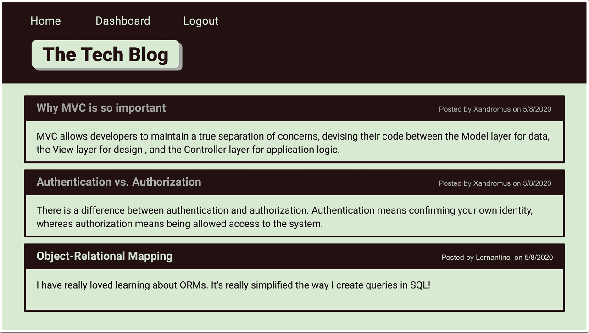

# blog-typebeat

[](https://opensource.org/licenses/MIT)


A Random MVC Tech Blog. 


## Description 

This is a CMS-style blog site similar to a Wordpress site, where developers can publish their blog posts and comment on other developers’ posts. This is build from scratch. This application will follow the MVC paradigm structure, Sequelize as the ORM, using Handlebars.js as a template language, and the express npm package for authentication.


## User Story
```
AS A developer who writes about tech
I WANT a CMS-style blog site
SO THAT I can publish articles, blog posts, and my thoughts and opinions
```

## Technologies Used

Handlebars.js, Express, Sequelize, Dontev Package, Bcrypt Package, MySQL2 and Express.js


## Installation
```
npm install
mysql -u root -p
CREATE DATABASE tech_blog_typebeat_db;
node server.js
```

## Visual Demo




## Links

[GitHub Repo](https://github.com/kitkatt17/blog-typebeat)

Heroku Link NOT WORKING at the moment.
[Heroku Deployed Link]()

## License

[](https://opensource.org/licenses/MIT)
 
[MIT License](https://opensource.org/license/mit-0/)
 
For the complete text of the license, please click on the link provided.